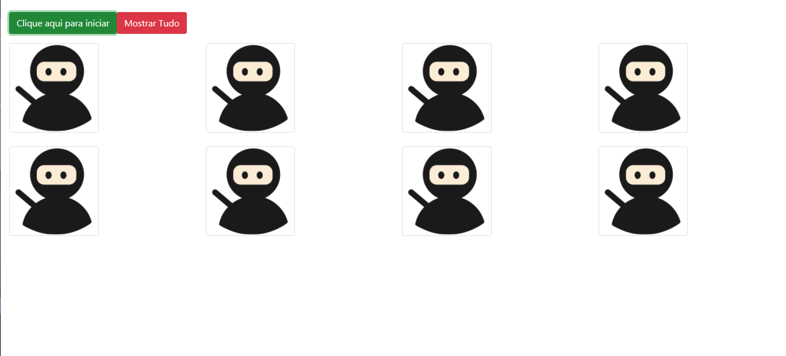

# Jogo da Memória

* O jogo trás uma lógica javascript num estilo jogo da memória que tem por objetivo encontrar duas figuras iguas ao serem clicadas;

* O jogo leva uma lógica funcional no back-end;

* Imagens de heróis;